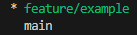
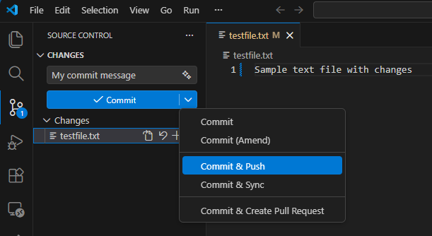
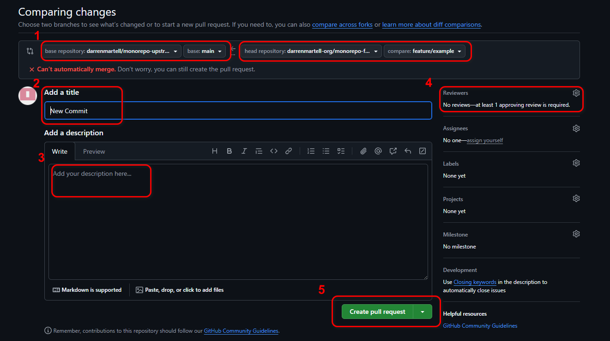

# GitHub Workflow with Forks

## Creating a Branch
Before you start coding, you must create a new branch. This can be named anything but should indicate at a high level what is being coded. To create a branch, execute the following git command:
```shell
git switch -c <new-branch-name>
```
(Note: This is the modern equivalent to `git checkout -b <new-branch-name>`. It creates a new branch and switches to it, providing a clearer separation of concerns from other checkout uses.)

You can then use the following commands to switch back and forth between the `main` branch and your development branch.

```shell
git switch <new-branch-name>
git switch main
```

## Committing and Pushing Your Work to GitHub
<span style="color: red;">NOTE: DO NOT ADD OR MODIFY CODE IN THE MAIN BRANCH.  ALWAYS WORK IN YOUR DEVELOPMENT BRANCH</span>

### Check Your Current Branch
First, make sure you are in your development branch by running the following command:
```shell
git branch
```
The current branch will appear in green as shown in the example below.<br>
<br>
If this is not the correct branch, use `git switch <branch-name>` to switch to the correct working branch.<br>

### Committing Your Work
Once you are in the correct branch, commit to your working branch often! This is easily done in VS Code by selecting the Source Control section of the left sidebar, entering a commit message and pressing the Commit button.  This is shown in the image below:<br><br>
<br>

### Pushing your Work to GitHub
The first time you push your working branch to GitHub, you will need to push with the following command in order to track your local branch with its equivalent in origin (GitHub). Run the command below to push with tracking: 
```shell
git push -u origin <new-branch-name>
```

All subsequent pushes can perfomed by either of the following:
```shell
git push
git push origin <branch-name>
```

### Committing and Pushing in One Step
You can also both Commit and Push by selecting the Source Control section of the left sidebar, entering a commit message and then selecting Commit and Push in the Commit button dropdown and then pressing the Commit and Push button. This is shown below:<br><br>
<br>


## Creating a Pull Request
When you are ready to create a Pull Request (request to merge into the upstream repo), navigate to your fork repo in [GitHub](https://www.github.com). You should see a message indicating that you can create a pull request for your work.  This will be similar to the following:<br><br>
<br>  

After clicking on Compare & pull request, the create pull request page will automatically open which will be similar to the following image:<br><br>
<br>  

On the Create Pull Request page, perform the following:
1. Ensure that the main branch of remote upstream (base) repository is on the left of the comparison and that your feature (working) branch of your remote origin (head) repository is on the right
2. Add a PR title
3. Add a brief description of what the PRO does
4. Select Reviewers (Sarah and Darren)
5. Press Create pull request


## Merging Upstream Back to Your Fork

After you make your commit and push/publish your branch, and make your PR, and once it's merged into upstream main, you will need to make sure that you update your origin and local repo.  There are 2 ways this can be performed. *Whichever method you choose, perform this after EVERY Pull Request that has been merged into upstream.*


### 1. Traditional Method:

```shell
git fetch upstream
```
- This downloads all the latest commits from the upstream repository (the original repo you forked) but does not change your local branches yet.
- It updates your remote-tracking branches like upstream/main.

```shell
git checkout main
```
- Switches your local branch to main (your fork’s main branch is usually tracking origin/main).

```shell
git merge upstream/main
```
- This merges the latest upstream main into your local main.
- After this step, your local main contains all the commits from upstream.

```shell
git push origin main
```
- Pushes your updated local main to your fork on GitHub (origin/main).
- Now your fork’s main is fully in sync with upstream.

### 2. Modern method (The Full Stack course way of updating local and origin main):

```shell
git switch main
```
- This switches to your local main repository

```shell
git pull upstream main
```
- This both fetches and merges commits from the upstream main repository.

```shell
git push origin main
```
- Pushes your updated local main to your fork on GitHub (origin/main).
- Now your fork’s main is fully in sync with upstream.

<span style="color: green;">After merging upstream, be sure to create a new branch before you start work again.</span><br>
<span style="color: red;">It is strongly recommended to delete your old branch.</span>

## Notes
If you ever want to make sure that you're pushing to origin and not upstream, check with this:
```shell
git branch -vv
```
